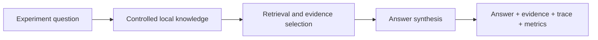
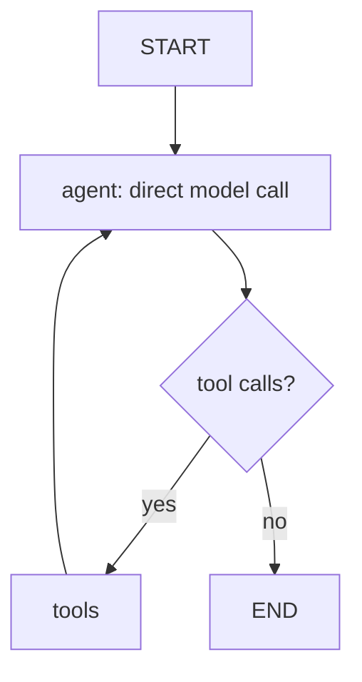
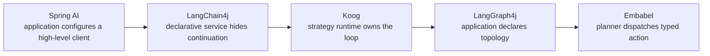

# Five Ways to Build the Same AI Capability

## Lessons from Spring AI, LangChain4j, LangGraph4j, Koog, and Embabel

**Argonaut technical article**  
**Scope:** UC-001, the controlled-local-evidence experiment  
**Evidence basis:** repository-local implementations, tests, contracts, and the [UC-001 comparative synthesis](../../engineering/agents/reports/ARGONAUT-MILESTONE-UC001-001-five-framework-comparative-synthesis.md)

> **Abstract.** Argonaut implemented one evidence-grounded AI capability five times on the JVM. Every implementation accepted the same request, used the same controlled corpus, returned the same evidence, trace, and metrics shape, and passed the same behavioral contract. They did not, however, execute it in the same way. The exercise revealed five different answers to one architectural question: who owns the next step? This article explains the control models that emerged, what they make easy or visible, and why the answer is contextual rather than a framework ranking.

## 1. Why we ran this experiment

Argonaut is a comparative laboratory for JVM AI frameworks. Its aim is deliberately narrower than selecting a platform: run the same mission through multiple frameworks while holding the external model boundary, controlled evidence, observable result contract, and evaluation conditions as steady as practical.

UC-001 asks a modest but useful question: can an implementation answer a question using only controlled local evidence, then return the answer together with the evidence it used, a trace, and simple metrics? We built that capability with Spring AI, LangChain4j, LangGraph4j, Koog, and Embabel.

This is not a comparison of model quality, token cost, provider performance, framework popularity, or production resilience. The tests use deterministic doubles. The comparison is about programming model: how each implementation represents retrieval, state, continuation, model invocation, observability, and the testing surface.

The central result is simple: there is no universally best framework among the five. They put execution control in different places, and different problem shapes benefit from different ownership.

## 2. The controlled use case

The input is a question about why an experiment should begin with controlled local evidence. The implementation searches an in-memory repository backed by five versioned Markdown documents, reads relevant documents, builds evidence, synthesizes an answer, and returns an `ExperimentResult`.



The important constraint is behavioral, not procedural. Every framework must satisfy the same executable contract. The contract requires completed status, a non-blank answer, evidence from `exp-001`, required lifecycle events, trace ordering and pairing, internally consistent metrics, no errors, and traceability from returned evidence to a real document read.

```java
// argonaut-core/.../ControlledLocalEvidenceContract.java
public static void verify(ExperimentExecutor executor) {
    assertSatisfied(executor.execute(request()));
}

// SC4: evidence cannot be hard-coded without a corresponding read trace.
for (Evidence evidence : result.evidence()) {
    assertTrue(tracedSourceIds.contains(evidence.sourceId()),
            "SC4: Evidence.sourceId is not traceable to a repository read");
}
```

That shared contract prevents a pleasant but misleading comparison in which every framework produces a plausible answer through unrelated shortcuts. It makes the **observable semantics** comparable while intentionally leaving internal execution semantics free.

## 3. Five frameworks, five mental models

The following descriptions are observations from the five UC-001 adapters. They are not claims that any framework is limited to this surface.

| Framework | UC-001 mental model |
| --- | --- |
| Spring AI | High-level imperative AI integration inside a Spring application |
| LangChain4j | Declarative AI-service interface with a hidden tool loop |
| LangGraph4j | Explicit state and explicit topology |
| Koog | Configured agent runtime and strategy loop |
| Embabel | Typed goal/action invocation with deterministic work inside the action |

All five can produce the same result envelope. The divergence begins once the question becomes: *what happens after the question arrives?*

## 4. Spring AI: AI as part of a Spring application

The Spring AI implementation looks much like ordinary Spring application code. It owns a `ChatClient` and a Spring tool component. The application expresses the prompt, user message, available tool, and per-run context; the high-level client handles continuation around tool calling.

```java
// argonaut-spring-ai/.../ControlledLocalEvidenceAgent.java
final String answer = chatClient.prompt()
        .system(ControlledLocalEvidencePrompt.SYSTEM_PROMPT)
        .user(request.question())
        .tools(knowledgeTool)
        .toolContext(Map.of("observer", observer, "reads", reads))
        .call()
        .content();
```

The distinctive state decision is `ToolContext`. `KnowledgeTool` is a Spring-managed component, while the observer and read accumulator belong to one run. They are supplied at the call boundary rather than stored in the singleton.

This is natural when an AI capability is a bounded part of a Spring service: compose familiar beans, call a high-level client, and surface a framework-specific capability as a tool. The trade-off observed in UC-001 is that the internal continuation and exact model-call count are not visible at this level. The adapter records Argonaut events around the tool and agent boundary; its `modelCalls` value is hard-coded to one, not a measured loop count.

## 5. LangChain4j: the declarative AI service

LangChain4j makes the interaction read like an application service interface. An annotated interface declares the user-facing operation, and an `AiServices` builder connects it to a model and a per-run tool object.

```java
// argonaut-langchain4j/.../ControlledLocalEvidenceAgent.java
interface KnowledgeAssistant {
    @SystemMessage(ControlledLocalEvidencePrompt.SYSTEM_PROMPT)
    String answer(String question);
}

var assistant = AiServices.builder(KnowledgeAssistant.class)
        .chatLanguageModel(chatModel)
        .tools(tools)
        .build();
final String answer = assistant.answer(request.question());
```

The tools are ordinary Java methods marked with LangChain4j annotations. Unlike Spring AI's `ToolContext` pattern, the implementation constructs a fresh `KnowledgeTools` object for each run so that the observer and read accumulator are safely owned by that run.

```java
@Tool("Search the controlled local knowledge corpus for relevant documents.")
public String searchKnowledge(@P("The query") String query) {
    // records trace events, then delegates to KnowledgeRepository
}
```

This is compact because `AiServices` hides the tool-calling loop. That is a useful abstraction when declaring the AI boundary matters more than describing every transition. It is also the cost: UC-001 cannot reliably count the model calls inside that loop, so it reports zero to mean **unknown**, rather than inventing a comparable number. Concise code and universal architectural fit are different claims.

## 6. LangGraph4j: when the flow becomes the program

LangGraph4j makes the continuation visible. UC-001 uses a small ReAct graph: an `agent` node calls the model, a conditional edge checks whether the latest assistant message asks for tools, a `tools` node executes them, and the graph returns to `agent` until an answer has no tool request.

```java
// argonaut-langgraph4j/.../ControlledLocalEvidenceAgent.java
var graph = new MessagesStateGraph<ChatMessage>(serializer)
        .addNode("agent", node_async(state -> {
            var messages = new ArrayList<ChatMessage>();
            messages.add(SystemMessage.from(ControlledLocalEvidencePrompt.SYSTEM_PROMPT));
            messages.addAll(state.messages());
            observer.record(agentEvent(ExecutionEventType.MODEL_CALL_STARTED, Map.of()));
            var response = chatModel.chat(ChatRequest.builder()
                    .messages(messages)
                    .parameters(ChatRequestParameters.builder().toolSpecifications(toolSpecs).build())
                    .build());
            observer.record(agentEvent(ExecutionEventType.MODEL_CALL_COMPLETED, Map.of()));
            return Map.of("messages", response.aiMessage());
        }))
        .addNode("tools", node_async(state -> toolService.execute(
                ((AiMessage) state.lastMessage().orElseThrow()).toolExecutionRequests(),
                InvocationContext.builder().build(), "messages").get().update()))
        .addEdge(START, "agent")
        .addConditionalEdges("agent", edge_async(state -> state.lastMessage()
                .filter(m -> m instanceof AiMessage ai && ai.hasToolExecutionRequests())
                .map(_ -> "tools").orElse(END)), Map.of("tools", "tools", END, END))
        .addEdge("tools", "agent")
        .compile();
```

```java
var finalState = graph.invoke(Map.of("messages", UserMessage.from(request.question())))
        .orElseThrow(() -> new IllegalStateException("graph produced no final state"));
```



For UC-001, LangGraph4j is wearing a tuxedo to buy bread. The controlled experiment needs a short retrieve-and-synthesize path; the state schema, graph compilation, serializer, node actions, and edges can look ceremonial beside a one-line high-level client call.

That is not a criticism of the graph model. It is evidence that UC-001 under-exercises it. When evolving state, named transitions, conditional branches, loops, state inspection, or checkpoint-like reasoning are themselves part of the problem, making the flow visible may be exactly the point. It also provides a real model-call boundary: UC-001 wraps `chatModel.chat(...)` directly and accurately counts those calls.

## 7. Koog: the agent loop as a strategy

Koog retains the familiar tools-and-agent shape but puts the continuation inside an agent runtime strategy. The adapter makes a new tool set, registry, and agent for each run, then uses lifecycle handlers to observe model calls.

```kotlin
// argonaut-koog/.../ControlledLocalEvidenceAgent.kt
val toolRegistry = ToolRegistry { tools(knowledgeTools) }
val agent = AIAgent(
    promptExecutor = executor,
    llmModel = llmModel,
    toolRegistry = toolRegistry,
    systemPrompt = ControlledLocalEvidencePrompt.SYSTEM_PROMPT,
    maxIterations = 10
) {
    handleEvents {
        onLLMCallStarting { observer.record(agentEvent(MODEL_CALL_STARTED, emptyMap())) }
        onLLMCallCompleted { observer.record(agentEvent(MODEL_CALL_COMPLETED, emptyMap())) }
    }
}
```

The contrast with LangGraph4j is productive. In LangGraph4j the application describes the topology. In this Koog adapter the application configures a runtime, its tools, bounds, and event handling, while the selected strategy owns the loop. The observed benefit is accurate lifecycle-derived model-call counting without manually spelling out graph transitions. The trade-off is that UC-001 exercises only the default/simple strategy, so it does not establish how Koog would compare for a bespoke control flow.

## 8. Embabel: stop thinking in loops

Embabel changes the question. Rather than first describing a loop, the adapter declares an agent action that can turn an `EvidenceQuestion` into an `EvidenceAnswer`.

```java
// argonaut-embabel/.../ControlledLocalEvidenceAgent.java
@AchievesGoal(description = "Answer the experiment question using only controlled local evidence")
@Action
public EvidenceAnswer answer(EvidenceQuestion question, OperationContext context) {
    var searchResponse = knowledgeRepository.search(
            new KnowledgeSearchRequest(question.question(), 5));
    // read the selected documents deterministically
    AnswerText answerText = context.ai().withDefaultLlm()
            .createObject(prompt, AnswerText.class);
    return new EvidenceAnswer(finalAnswer, evidences, trace, metrics);
}
```

The production controller invokes the typed goal through the platform:

```java
// argonaut-embabel/.../ExperimentController.java
EvidenceAnswer answer = AgentInvocation
        .builder(agentPlatform)
        .build(EvidenceAnswer.class)
        .invoke(new EvidenceQuestion(request.runId(), request.question()));
```

Conceptually, the boundary is **I have `EvidenceQuestion`; I want `EvidenceAnswer`**. In UC-001 the platform selects a single goal-achieving action. Inside that action, retrieval is deterministic Java: search the repository, read the top results, construct evidence. Only synthesis is LLM-driven.

That gives UC-001 a particularly clean action-level test seam: a `FakeOperationContext` can supply the structured synthesis result while the repository work remains real. It does **not** prove broader planning behavior. A single goal and a single action under-exercise the very planning and composition questions that make this model interesting. Embabel, too, is wearing a tuxedo to buy bread here.

## 9. Same contract, completely different execution

The main comparison is not a feature checklist. It is a reminder that equivalent output does not imply equivalent execution.

| Framework | Execution ownership | Retrieval ownership | Per-run state | Flow visibility | Model visibility | Natural test unit | UC-001 fit | Significant capability under-exercised |
| --- | --- | --- | --- | --- | --- | --- | --- | --- |
| Spring AI | `ChatClient` internal loop | LLM tool calls | `ToolContext` map | Hidden | Opaque; `1` is hard-coded | Service + mock model | Direct and compact | More detailed loop instrumentation/control |
| LangChain4j | `AiServices` internal loop | LLM tool calls | Per-run tool + AI service | Hidden | Opaque; `0` means unknown | AI service + mock model | Direct and compact | Custom intermediate control/visibility |
| LangGraph4j | Application graph | Model requests tools; graph routes | Node closures and graph | Explicit | Direct, accurately counted | Graph + mock model | More ceremony than needed | Rich routing/state history/checkpoint behavior |
| Koog | Agent runtime strategy | LLM tool calls | Per-run agent, registry, tools | Strategy-hidden | Event-derived, accurate | Agent runtime + mock executor | Compact agent-loop fit | Alternative/custom strategies |
| Embabel | Goal/action dispatch plus action code | Deterministic action code | Action-local values | Goal/action visible; retrieval is code | Synthesis call shape known, not hook-counted | Action + fake context | Simple action fit | Multi-action planning/composition |

Same observable behavior does not mean same execution semantics. “Agentic RAG” is not one architecture.

## 10. The important question: who owns the next step?

The most useful selection question raised by UC-001 is not “which framework has the most features?” It is: **where should execution control live for this problem?**



This diagram is not a sophistication ranking or a maturity ladder. The models differ in *where they place control*, not in whether they are “more agentic.” Spring AI and LangChain4j reduce the visible control surface. Koog centralizes a loop in a configurable runtime strategy. LangGraph4j makes routing a first-class application artifact. Embabel frames execution as finding an action that satisfies a typed goal, while the action may still make ordinary deterministic choices.

State ownership follows the same decision. A Spring tool receives per-run state through a context map. LangChain4j and Koog construct per-run collaborators. LangGraph4j captures state in graph-building closures and message state. Embabel keeps it local to the action. None is an implementation footnote: it determines lifecycle, isolation, and how an engineer can inspect or test a run.

## 11. Deterministic and stochastic control

UC-001 also disproves a common shortcut in AI architecture: an AI-powered system does not need a stochastic control plane.

Four adapters expose knowledge access to the model as a tool and allow the model to decide whether to call it. Embabel's UC-001 action instead uses this shape:

```text
deterministic search
        -> deterministic document reads
        -> evidence construction
        -> stochastic, structured answer synthesis
```

Both approaches meet the same result contract. The architectural lesson is not that deterministic retrieval is always preferable. It is that deterministic and stochastic boundaries should be placed deliberately. Allowing a model to decide a step is useful when the problem needs that discretion; keeping a step deterministic is useful when the policy is already known, repeatability matters, or the step has a crisp testable contract.

## 12. “Tool” was not the abstraction we thought it was

The UC-001 adapters initially look as though they share a universal concept named `Tool`:

| Framework | How knowledge access appears |
| --- | --- |
| Spring AI | framework `@Tool` methods |
| LangChain4j | framework `@Tool` methods |
| LangGraph4j | tool service executed from a graph node |
| Koog | `ToolSet` registered in `ToolRegistry` |
| Embabel | direct `KnowledgeRepository` calls inside an action |

What survived the comparison was not a shared tool abstraction. It was the domain capability:

```java
// argonaut-core/.../KnowledgeRepository.java
public interface KnowledgeRepository {
    KnowledgeSearchResponse search(KnowledgeSearchRequest request);
    DocumentContent read(DocumentReference reference);
}
```

`Tool` is an execution/exposure mechanism. `KnowledgeRepository` is a capability Argonaut owns. That distinction matters beyond RAG. A common abstraction should emerge because the domain needs the concept, not because several frameworks happen to use similarly named APIs. Turning `KnowledgeRepository` into a universal “tool” would make Embabel's direct use look exceptional when it is simply another valid adapter.

## 13. Observability is part of the programming model

Argonaut normalizes the trace required by the experiment: run start/end, knowledge search, document reads, evidence retrieval/selection, and answer synthesis. Those events are intentionally common because the experiment and UI need them, not because the frameworks natively expose identical lifecycles.

The differences begin at the model boundary. LangGraph4j directly surrounds `chatModel.chat(...)`; Koog receives model lifecycle callbacks through `handleEvents`. Spring AI's high-level `ChatClient` and LangChain4j's `AiServices` conceal their internal loop in this adapter. Embabel has a single visible structured-synthesis call inside the action but no action-local hook used to count it.

The current `ExecutionMetrics` shape therefore needs careful reading. `modelCalls` is exact for LangGraph4j and Koog in UC-001, hard-coded for Spring AI and Embabel, and unknown for LangChain4j. `toolCalls` is currently zero in completed metrics construction even where framework tools run. These values are not uniformly comparable measurements and must not be ranked.

A useful future lesson - not a current implementation - is metric provenance: `EXACT`, `INFERRED`, or `UNKNOWN` alongside a count. Without provenance, a neat comparison table can imply false precision.

## 14. Testability reveals the natural unit

Every implementation passes `ControlledLocalEvidenceContract`, but the natural isolated unit differs.

- **Spring AI:** service plus a mock chat model that returns the expected tool-call sequence.
- **LangChain4j:** AI service plus a mock model that drives `AiServices`' hidden loop.
- **LangGraph4j:** compiled graph plus a mock model; routing is directly testable alongside result behavior.
- **Koog:** configured agent runtime plus a mock prompt executor; the test includes the strategy/runtime boundary.
- **Embabel:** the annotated action plus `FakeOperationContext`; real deterministic repository access remains in the test.

There is no universal testing winner. Embabel is particularly clean for UC-001's single deterministic action. LangGraph4j is particularly direct when topology is a behavior worth testing. The test surface should influence selection because it reveals what each model asks the application to own.

## 15. So, which framework should I use?

The following is contextual guidance, explicitly bounded by UC-001. It is an architectural inference from the observed adapters, not a benchmark result.

| If your problem looks like... | Evaluate first | Trade-off / warning sign | UC-001 confidence |
| --- | --- | --- | --- |
| A Spring service needs a bounded prompt-and-tool capability | Spring AI | A need for exact loop-level control, topology, or metrics may outgrow the high-level boundary | Moderate for simple tool use |
| A concise Java AI service interface and annotated tools describe the interaction well | LangChain4j | Opaque intermediate steps or complex per-run state can make the hidden loop limiting | Moderate for declarative tool use |
| Explicit state, branches, loops, and inspectable transitions are domain requirements | LangGraph4j | A straight-line exchange may be obscured by graph machinery | High that explicit topology is its differentiator; low beyond UC-001 |
| A Kotlin application wants a configured agent runtime, bounded strategy, tools, and lifecycle events | Koog | UC-001 did not test custom strategy design or Java/Spring integration beyond the bridge | Moderate |
| Typed goals/actions and deterministic business work should frame the LLM step | Embabel | Multi-action planning is the attraction, yet UC-001 did not exercise it | Moderate for one action; low for broader planning |

The best framework is contextual. Prefer the abstraction whose control model resembles the problem you actually have, rather than the one with the longest feature list or shortest initial adapter.

## 16. What we refused to abstract

After five implementations, Argonaut still should not introduce `UniversalAgent`, `UniversalTool`, `UniversalGraph`, `UniversalPlanner`, or `UniversalModelCall`. Each would smooth over the mechanisms the experiment exists to compare:

- a tool is optional and framework-specific;
- an explicit loop is optional;
- graph state, runtime strategy state, context-map state, and action-local state mean different things;
- model invocation boundaries are visible at different layers.

The abstractions that remain justified are narrower and domain-owned: `KnowledgeRepository`, `ExperimentRequest`, `ExperimentResult`, `Evidence`, `ExecutionTrace`, `ExecutionMetrics`, and the behavioral verification contract. This is a familiar hexagonal-architecture discipline: share the stable vocabulary at the domain and external boundary, not the adapter mechanics that happen to be similar today.

## 17. What UC-001 cannot tell us

UC-001 is deliberately small and controlled. It cannot support claims about:

- model/provider answer quality, cost, latency, or streaming;
- production resilience, retries, security, or operational integration;
- multi-turn memory or checkpoint/resume behavior;
- a fair efficiency comparison, because mocks make different call sequences;
- LangGraph4j's richer topology/state facilities;
- Embabel's multi-action planning and composition;
- Koog beyond its default/simple strategy;
- uniformly exact model- or tool-call metrics.

These limitations are productive. They keep an architecture experiment from becoming accidental marketing.

## 18. Why UC-002 is necessary

A second experiment should give graph and planning abstractions a problem that warrants a tuxedo. It need not be designed here, but it should require evolving state, conditional branches, alternative valid paths, validation, revision or retry, parallel work and join, possibly several responsibilities, and optional human intervention. It should also require observable topology and provenance.

That would test the value of visible routing, strategy choice, and action planning under conditions where they change the outcome rather than merely adding ceremony. The shared input, evidence conditions, output contract, and evaluation discipline must remain controlled.

## Conclusion

We started by looking for differences between five AI frameworks. What we found were five different answers to a more fundamental architectural question: **who should control the next step?**

Spring AI, LangChain4j, LangGraph4j, Koog, and Embabel all satisfied the same UC-001 contract. They did so through high-level integration, a declarative service, explicit topology, a strategy runtime, and typed goal/action dispatch. None of those answers is universally correct. The appropriate abstraction depends on where the system needs determinism, visibility, flexibility, and planning.

That is the value of implementing the same capability several ways: it turns framework selection from a feature-counting exercise into a concrete discussion about control ownership.

## Evidence and related material

- [UC-001 comparative synthesis](../../engineering/agents/reports/ARGONAUT-MILESTONE-UC001-001-five-framework-comparative-synthesis.md) - primary engineering evidence.
- [Controlled Local Evidence RAG](../use-cases/controlled-local-evidence-rag.md) - durable use-case definition and behavioral target.
- [Argonaut Common Contract](../common-contract.md) - rationale and boundaries for shared contracts.
- Framework implementation reports under [`docs/engineering/agents/reports/`](../../engineering/agents/reports/).

All factual framework claims in this article are limited to repository-local UC-001 evidence as of 2026-08-23. Selection guidance is labeled architectural inference; unexercised capabilities are not presented as verified behavior.
