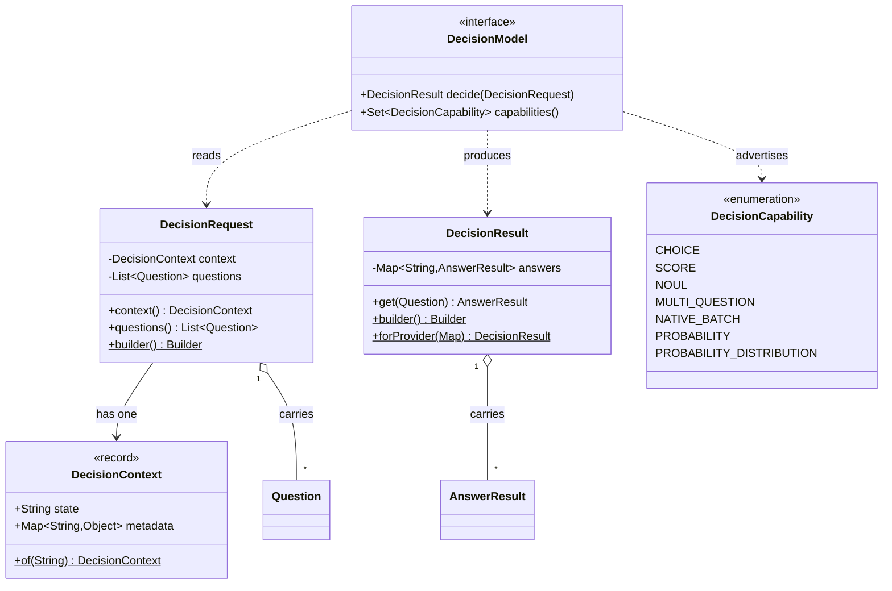
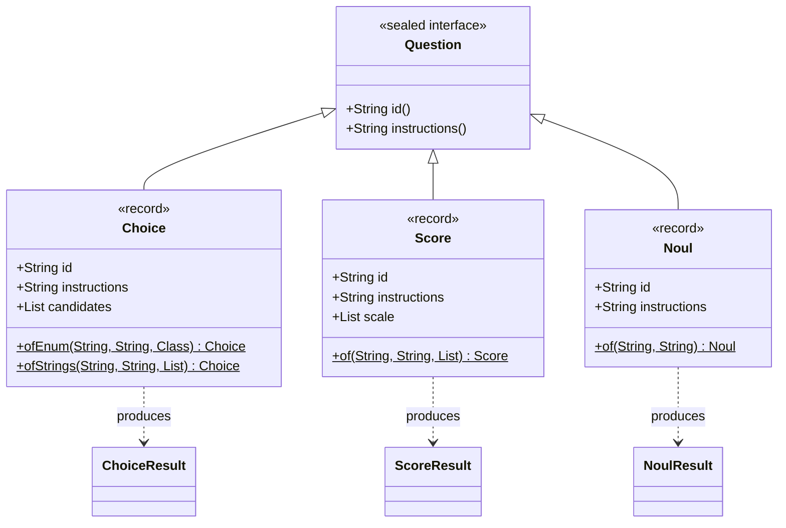
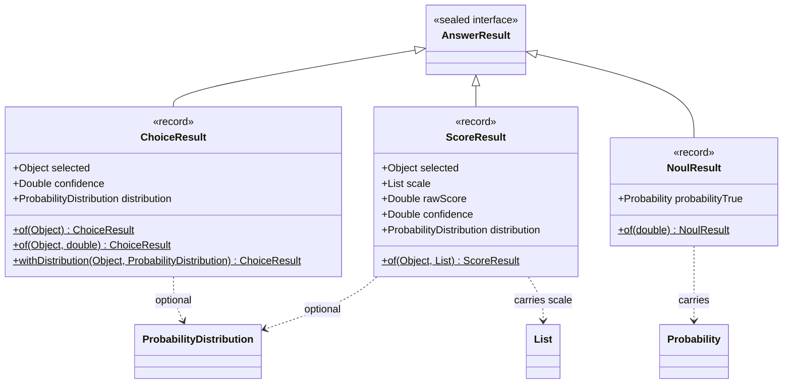
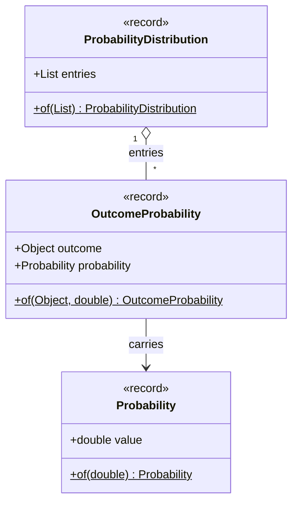
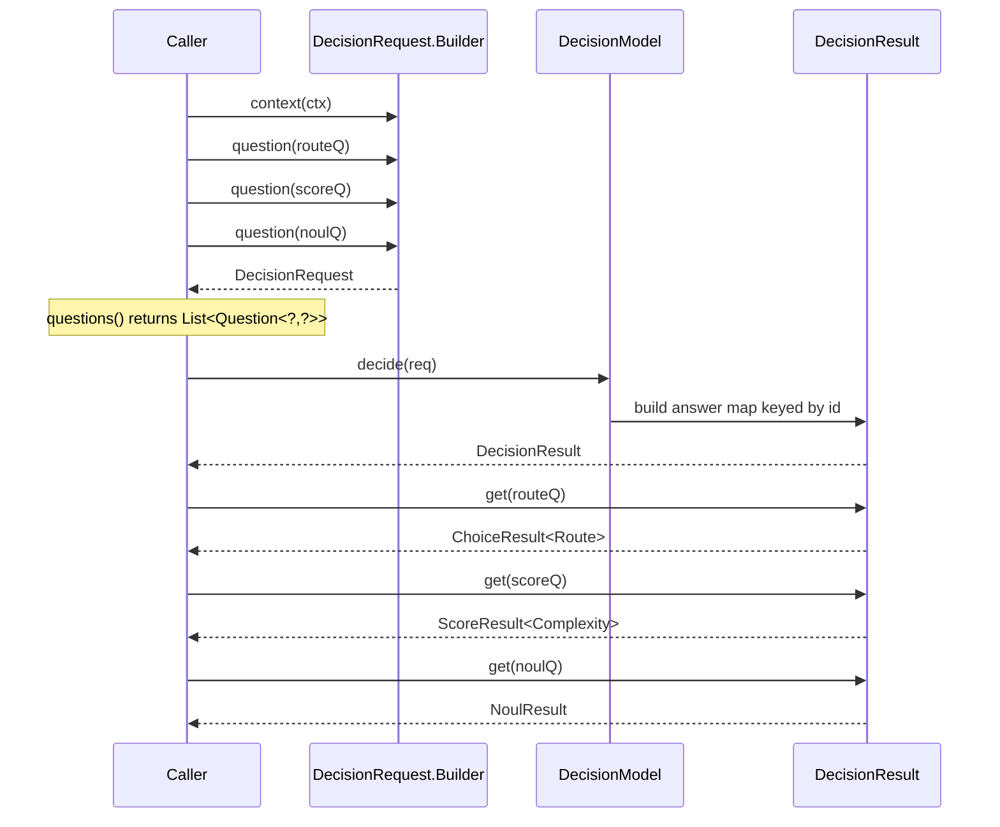
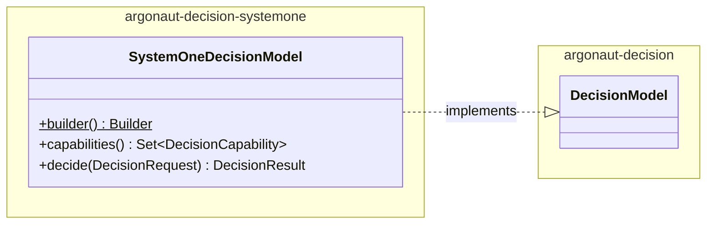

# Decision Model — Class Diagrams

> Mermaid class diagrams for `argonaut-decision`. Every diagram is sourced from `argonaut-decision/src/main/java/dev/jsanca/argonaut/decision/` and the test contract in `DecisionModelContractTest.java`. If a diagram disagrees with the code, the code wins.

The diagrams use Mermaid classDiagram syntax with single-type generics. Where a class has multiple type parameters (e.g. `Question<T, R>`), the second parameter and bounds are described in the Notes block beneath the diagram rather than encoded in the class name.

## 1. Module overview

The module has two sides: the application-facing **request / result** pair, and the **typed vocabulary** (Question, AnswerResult, Probability) that wires one to the other with no consumer cast.

Notes:

- `DecisionModel` is the only production seam. Applications depend on this interface; providers are pluggable.
- `DecisionContext.metadata` is an immutable copy (`Map.copyOf`), not a live view — verified by TC `decisionContext_metadata_immutable` in `DecisionRequestTest`.
- The empty-question rule (`DecisionRequest must contain at least one question`) and the duplicate-ID rule (`Duplicate question id in DecisionRequest`) are enforced in `DecisionRequest.Builder`, not in the providers.
- The unchecked cast at `DecisionResult.get` is documented as the one — and only — place it exists; the builder's typed `answer(Question<T,R>, R)` method enforces the pairing of question and result types.

## 2. Question hierarchy

Three record subtypes of a sealed interface. Each subtype fixes its result type (`R` parameter).

Notes:

- `Question<T, R extends AnswerResult<T>>`. The bound `R extends AnswerResult<T>` is what forces the type-safety at retrieval time; the Sealed permits clause (`permits Choice, Score, Noul`) makes "every Question has a result subtype" exhaustive at compile time.
- `Noul` has no `T` candidate domain (`T = Void`); the second parameter on `Noul` is fixed by `NoulResult` instead.
- Validation is in the compact constructors: blank id/instructions, empty `candidates` for `Choice`, scale size `< 2` for `Score`. All four are covered by `QuestionValidationTest`.
- `Choice.ofEnum(Class)` derives the candidate set from `type.getEnumConstants()`; `Choice.ofStrings(List)` accepts arbitrary strings.

## 3. Result hierarchy

Three record subtypes of a sealed interface. Sealed via `permits ChoiceResult, ScoreResult, NoulResult` on `AnswerResult<T>`.

Notes:

- `ChoiceResult.confidence` and `ScoreResult.confidence` are nullable: a `null` means **information not available**; `0.0` means **present and zero**. They are distinct values (TC-DM-007).
- `ChoiceResult.selected` is typed `T` (the question's candidate domain — `Route.class` for an enum Choice, `String` for an `ofStrings` Choice, etc.). `Object` in the diagram is a Mermaid limitation, not the contract type.
- `ScoreResult.scale` is duplicated in the result (not just the question) so callers can interpret a `selected` without holding on to the original question. TC-DM-003 asserts scale preservation and order.
- `ScoreResult.rawScore` is the provider's fractional position across the scale (e.g. `1.04`). It is **not** a calibrated probability (the Javadoc is explicit: *"this field must not be used to gate decisions in place of the full probability distribution"*).
- `NoulResult` exposes only `probabilityTrue`. There is no `selected()`, no `isTrue()` method, and no boolean conversion (TC-DM-004). Applying a threshold is a policy decision the contract defers.
- `AnswerResult` deliberately contains no `selected()` method on the supertype. Adding it would force a boolean threshold onto `NoulResult`, violating the architecture (per `AnswerResult` Javadoc).

## 4. Probability family

Notes:

- `Probability` validates `[0.0, 1.0]` plus finite. `NaN`, `±∞`, `-0.001`, and `1.001` all throw (TC-DM-009). The compact constructor: `if (!Double.isFinite(value) || value < 0.0 || value > 1.0) throw new IllegalArgumentException(...)`.
- A `Probability(0.0)` is a valid, constructable value — **not** a sentinel. "Probability unavailable" is `null`, not `0.0` (TC-DM-007). The two representations are provably distinct.
- `OutcomeProbability.outcome` and `ProbabilityDistribution.entries`'s outcomes are typed `T`. `Object` in the diagram is a Mermaid limitation, not the contract type.

## 5. Retrieval path — why "no consumer cast" compiles

The compile-time guarantee is that `result.get(question)` returns the question's declared `R`, where `R extends AnswerResult<T>` and the question's runtime class carries the same `R`. The single unchecked cast is isolated inside `DecisionResult.get`; it cannot be replicated by callers, who have to pass a `Question<T, R>` to recover a typed `R`.

The "no consumer cast" property comes from the fact that the three `get(question)` calls are typed against the `Question<T, R>` *parameter*. Because the question's `R` is fixed at construction (a `Choice<Route>` produces `ChoiceResult<Route>`), the assignment compiles without `@SuppressWarnings` (TC-DM-006).

## 6. DecisionModel provider/contract split

The contract is separated from the providers. Anything in `argonaut-decision` is fair game for tests and downstream modules; provider implementations live in sibling modules and depend on `argonaut-decision`, never the other way around.

- The graph in `argonaut-decision` has zero inbound arrows from provider modules. The reverse is enforced by Maven module structure: providers depend on the domain, the domain does not depend on providers.
- `SystemOneDecisionModel` defaults to TypeSafe AI's hosted Jev (`https://api.typesafe.ai`, model `jev-latest`). The same builder targets a local Kev or OpenRouter's System One-compatible endpoint by overriding `baseUrl(String)` and `modelName(String)` (from `SystemOneDecisionModel` Javadoc and `argonaut-decision-systemone/pom.xml` description).
